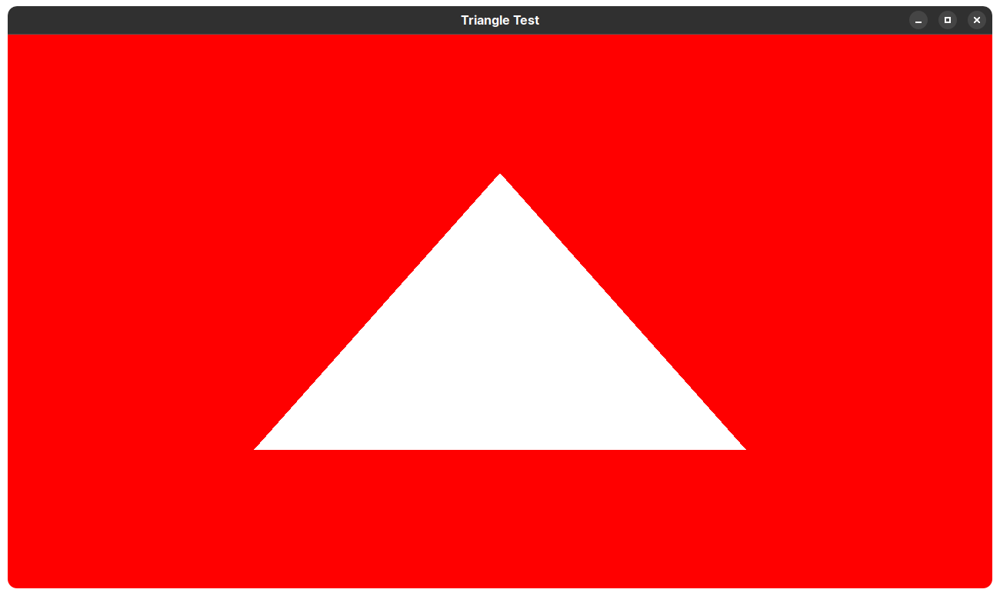

# About
This repository contains some simple OpenGL testing code for developers. The code is free to use without any license or restriction, since it is published on the public domain. The tests were written using C++ on Linux, with Mesa3D OpenGL implementations. It should work on most implementations the exact same way.

For the sake of convenience, a `Makefile` is also provided so you can test if it works the same way as mine. SRGB coloring and other monitor issues aren't handled yet so forget about it.

# Minimum Requirements
- OpenGL version:
Any OpenGL version after 2.1 should be supported fine. The recommended version is 3.0 and above especially if you plan to use this code on serious 3D games.
- OpenGL ES
Only OpenGL ES 3.0 and above should be supported, although not tested / guaranteed.

# Screenshots

    

